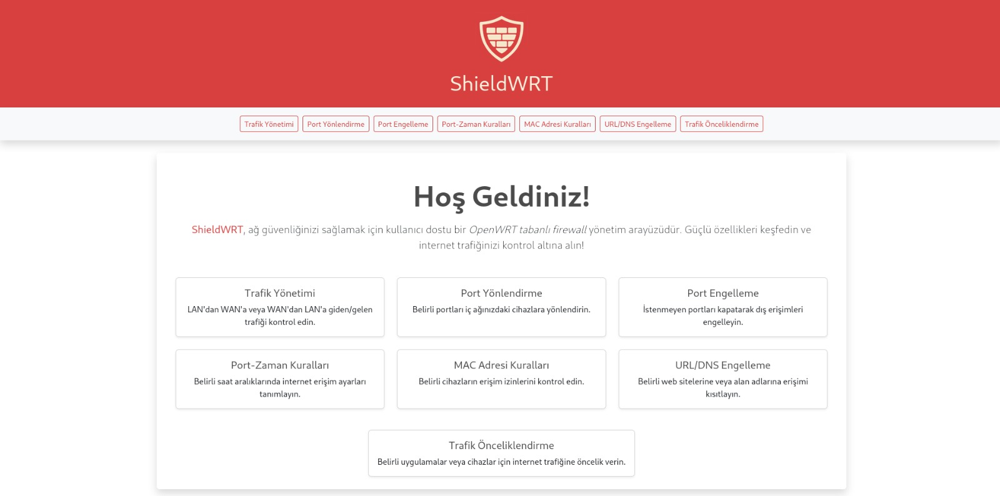
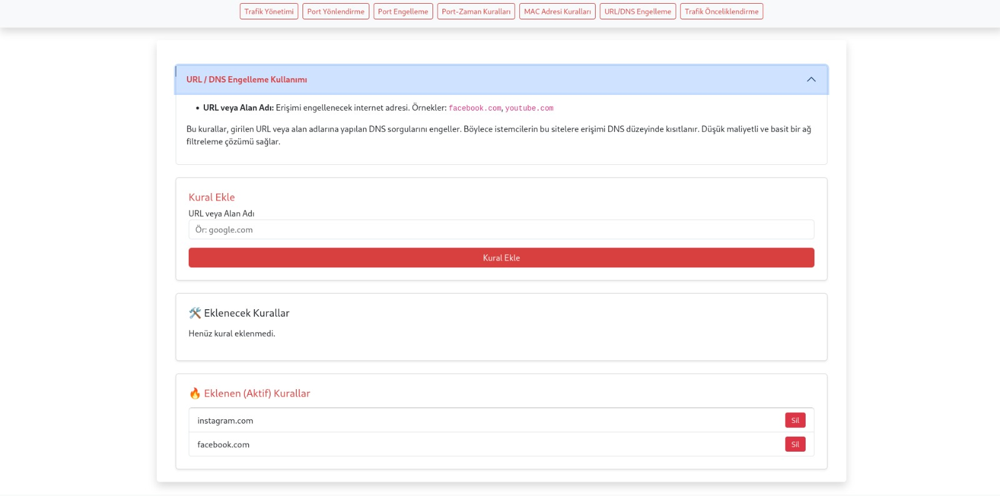
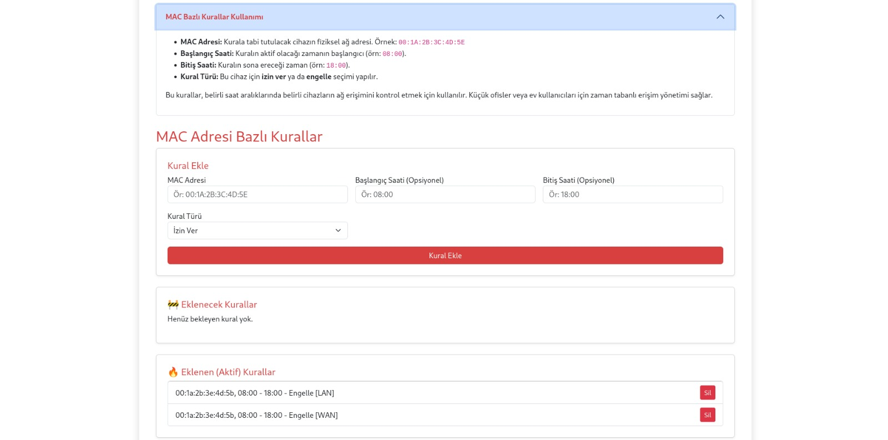
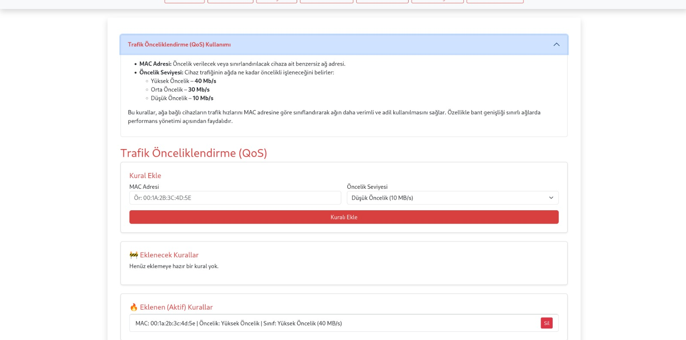
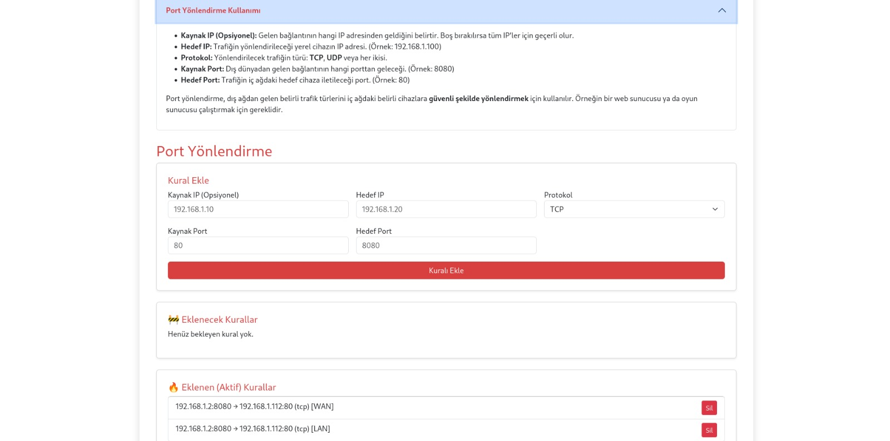
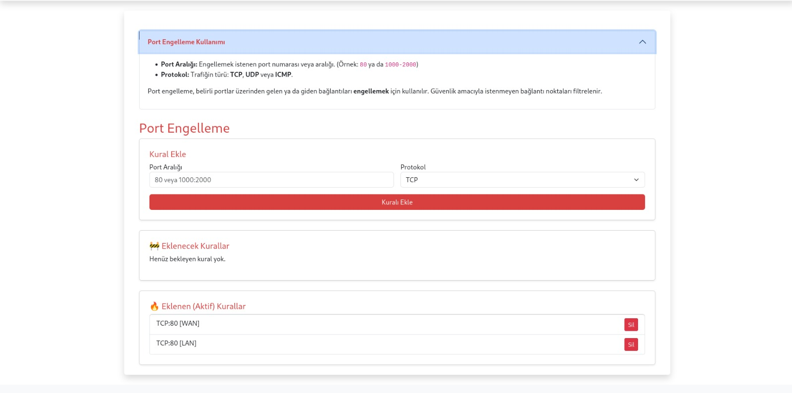
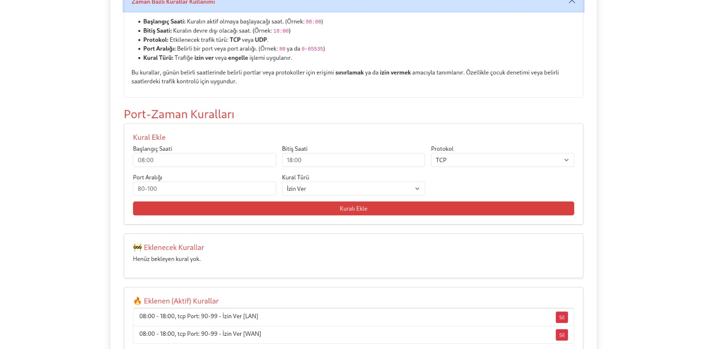
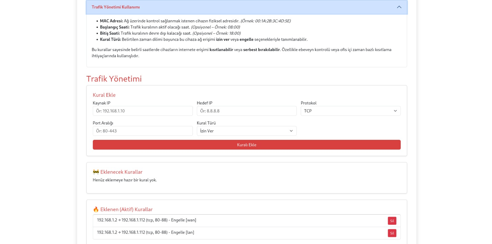

# 🛡️ **ShieldWrt**

🇹🇷 ShieldWrt, ev kullanıcıları ve küçük ofisler için düşük maliyetli, kullanıcı dostu bir ağ güvenlik çözümüdür. Web arayüzü üzerinden kolayca kural ekleme, düzenleme ve silme işlemleri yapabileceğiniz bu proje, temel ağ güvenliği ihtiyaçlarınızı teknik bilgiye ihtiyaç duymadan karşılamanızı hedefler.  
🇬🇧 ShieldWrt is a budget-friendly, user-friendly network security solution designed for home users and small offices. Through its web interface, users can easily add, edit, or delete firewall rules without requiring technical knowledge.

---

**🚀 Proje Tanıtımı / Project Overview**

🇹🇷 ShieldWrt, React ile geliştirilmiş bir kullanıcı arayüzü (UI) ve Node.js/Express ile yazılmış bir API sunucusundan oluşur. Her iki sistem de bir Raspberry Pi üzerinde çalışan OpenWRT tabanlı bir firewall'a bağlanarak ağ kurallarını yönetir.  
🇬🇧 ShieldWrt consists of a React-based UI and a Node.js/Express API server. Both systems interact with an OpenWRT-based firewall running on a Raspberry Pi, enabling full network rule management.

---

## 🧰 Kullanılan Teknolojiler/Technologies Used

- ⚛️ **React** — Arayüz/Frontend
- 🟩 **Node.js & Express** — API sunucusu/Backend Server
- 📡 **OpenWRT** — Firewall cihazı/Firewall OS (Raspberry Pi)
- 🔒 **SSH (ssh2)** — OpenWRT ile haberleşme/Communication with OpenWRT
- 📊 **CSV Loglama** — Her işlem sonrası kayıtları/Rule activity logging

---

## 📁 Alt Repos

- 🎛️ Kullanıcı Arayüzü/UI: [shieldwrt-ui]([https://github.com/kendi-adresin/shieldwrt-ui](https://github.com/ebrarkadir/react-firewall-ui))
- 🔧 API Sunucusu/API Server: [shieldwrt-api]([https://github.com/kendi-adresin/shieldwrt-api](https://github.com/ebrarkadir/openwrt-firewall-api))

---

## 🧱 Uygulamada Desteklenen 7 Kural Türü/7 Types of Rules Supported in the Application

Aşağıdaki tüm kurallar UI'dan yönetilebilir ve doğrudan OpenWRT'ye uygulanır:

| 🔢 | Kural Türü               | Açıklama                                                                 |
|----|--------------------------|--------------------------------------------------------------------------|
| 1  | **DNS Blocking**         |Belirli alan adlarının çözümünü engelleyerek internet erişimini durdurur.  Blocks specific domain resolutions to prevent access.|
| 2  | **MAC Rules**            | Cihazların MAC adresine göre ağa erişimini kısıtlar veya izin verir.  Restricts or allows network access based on MAC address. |
| 3  | **QoS Rules**            | Cihazlara trafik önceliği atar.  Assigns bandwidth priority per device. |
| 4  | **Port Forwarding**      | Belirli portlardan gelen trafiği iç ağ cihazlarına yönlendirir.  Forwards incoming traffic to internal IPs. |
| 5  | **Port Blocking**        | Belirli portlara erişimi engeller.  Blocks access to specified ports. |
| 6  | **Zaman Bazlı Kurallar** | Erişim izinlerini belirli saatlerde sınırlar.  Restricts access based on time ranges. |
| 7  | **Genel Firewall Kuralları** | Protokol, IP ve port bazlı detaylı kurallar.  Advanced filtering based on IP, protocol, and port.|

---

## 🖼️ Arayüz Ekran Görüntüleri / UI Screenshots

### 🏠 Ana Sayfa / Home Page

### 🌐 DNS Engelleme / DNS Blocking

### 📶 MAC Kuralları / MAC Rules

### 🚦 Trafik Önceliklendirme (QoS) / Traffic Prioritization

### 🔁 Port Yönlendirme / Port Forwarding

### ⛔ Port Engelleme / Port Blocking

### 🕒 Zaman Bazlı Kurallar / Time-Based Rules

### 🔥 Genel Kurallar / General Firewall Rules

---

**👤 Geliştirici / Developer**  
**Ebrar Kadir Çetin**  
📧 cetinebrarkadir@gmail.com  
🔗 GitHub: [https://github.com/ebrarkadir](https://github.com/ebrarkadir)  
💻 LinkedIn: [https://www.linkedin.com/in/ebrar-kadir-çetin-1a728019b](https://www.linkedin.com/in/ebrar-kadir-%C3%A7etin-1a728019b)

